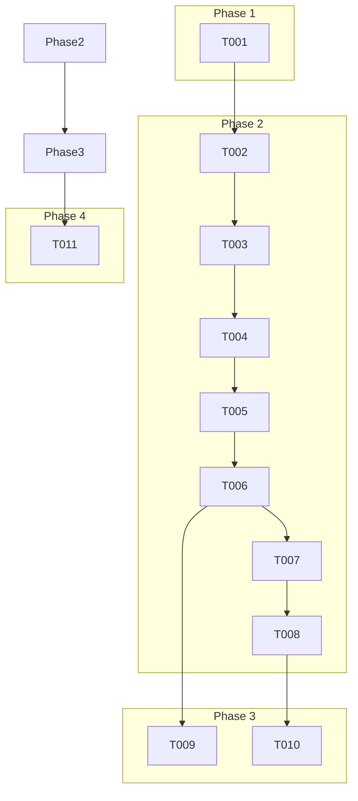

# Actionable Tasks for: Fix Engine Concurrency Error

**Branch**: `003-fix-engine-concurrency` | **Spec**: [spec.md](./spec.md)

This plan refactors the application's concurrency model to resolve engine stability issues. It introduces a dedicated worker thread to manage the `asyncio` event loop for all chess engine communication, decoupling it from the UI threads.

## Phase 1: Setup

- [x] T001 Add required imports (`threading`, `asyncio`, `queue`) to the top of `py_chessboardjs/start.py`.

## Phase 2: Foundational Refactoring (US1)

**User Story Goal**: As a user, I want the application to remain stable and not crash when I perform UI actions at the same time the chess engine is thinking.

**Independent Test Criteria**: The application can run a full game against the engine while random UI events are triggered, and it must not crash or hang.

### Implementation Tasks

- [x] T002 [US1] Define a new `EngineWorker` class in `py_chessboardjs/start.py` that inherits from `threading.Thread`. It will manage the `asyncio` event loop and the engine instance.
- [x] T003 [US1] Implement the `__init__` method for `EngineWorker` in `py_chessboardjs/start.py`. It should accept a callback for sending results back to the main thread and initialize a queue for incoming tasks.
- [x] T004 [US1] Implement the `run` method for `EngineWorker` in `py_chessboardjs/start.py`. This method will start a new `asyncio` event loop and process tasks from the queue until a "quit" task is received.
- [x] T005 [US1] Implement a coroutine within `EngineWorker` in `py_chessboardjs/start.py` to handle engine initialization and a separate one to handle move calculation using `chess.engine.SimpleEngine`.
- [x] T006 [US1] In the `Api` class `__init__` method in `py_chessboardjs/start.py`, refactor it to instantiate and start the `EngineWorker` thread, passing a callback function that can call `window.evaluate_js`.
- [x] T007 [US1] Refactor the `Api.on_closed` method in `py_chessboardjs/start.py`. It must now be thread-safe and signal the `EngineWorker` to shut down gracefully by putting a "quit" message on its task queue.
- [x] T008 [US1] Refactor the `Api.uci_engine_move` method in `py_chessboardjs/start.py`. It must be non-blocking. It will now put a "play" task with the current board FEN onto the `EngineWorker`'s queue.

## Phase 3: Frontend Adaptation (US1)

**User Story Goal**: (Same as Phase 2)

**Independent Test Criteria**: The frontend correctly receives and displays engine moves that are now pushed asynchronously from the backend.

### Implementation Tasks

- [x] T009 [P] [US1] In `py_chessboardjs/js/my-script.js`, create a new global function `receiveEngineMove(san)`. This function will be called by the Python backend to apply the engine's move to the `chess.js` instance and update the board.
- [x] T010 [US1] In `py_chessboardjs/js/my-script.js`, modify the `makeComputerMove` function. The call to `pywebview.api.uci_engine_move()` will no longer have a `.then()` block, as the move now arrives via the `receiveEngineMove` callback.

## Phase 4: Verification

**Goal**: Verify the concurrency fix and ensure application stability.

### Implementation Tasks

- [ ] T011 Manually execute all stress tests outlined in `specs/003-fix-engine-concurrency/quickstart.md` to confirm the bug is resolved.

## Dependencies

## Implementation Strategy

The refactoring will be done in phases:
1.  **Setup**: Add necessary imports.
2.  **Backend Refactor**: Implement the `EngineWorker` thread and refactor the `Api` class to delegate all engine communication to it. This is the most complex part of the fix.
3.  **Frontend Adaptation**: Adjust the JavaScript to handle the new asynchronous way engine moves are received.
4.  **Verification**: Thoroughly stress-test the new architecture to ensure the concurrency issues are resolved.
